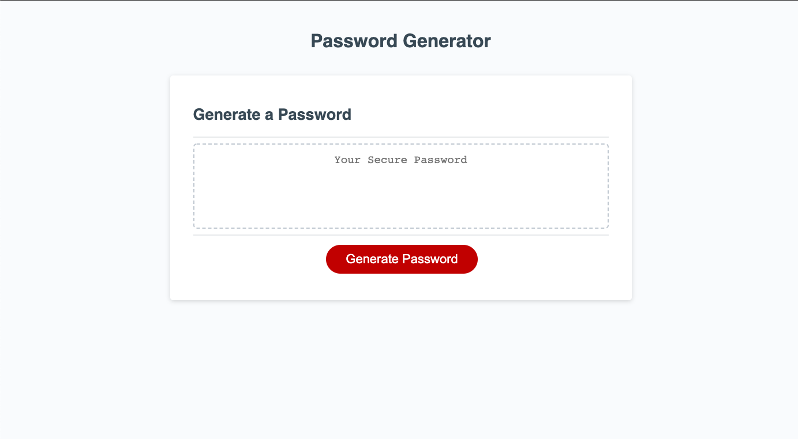

# Password Generator

## Table of Contents 

* [Installation](#installation)
* [Usage](#usage)
* [Credits](#credits)
* [License](#license)
* [Contributing](#contributing)

## Installation 

No installation necessary. The site can be accessed here: https://jesscru.github.io/password-generator/.

## Usage 

This page will, upon clicking the "Generate Password" button, generate a password for the user based on responses to a series of questions concerning the password's character type and length. The user will be asked whether they would like their password to include lowercase and uppercase letters, special characters, and numbers in addition to the length they would like their password (in terms of character number). The user will have to choose a password with a character length of at least 8 and it may not exceed 128 charaters. The user's desired password characteristics will be placed into the textarea for their use. The following is what the user will view upon navigating to the website:

## Credits

This app is hosted by Github Pages. 

## License 

This project has an MIT license.

## Contributing

I welcome any ideas anyone might have to contribute to this project. Please reach me at the email below if you have suggestions or ideas you'd like to add to the project. 

## Questions 

Github username: jesscru

Github repository page: github.com/jesscru

If you have additonal questions or comments you can reach me at my email: jessicacrump7@gmail.com

